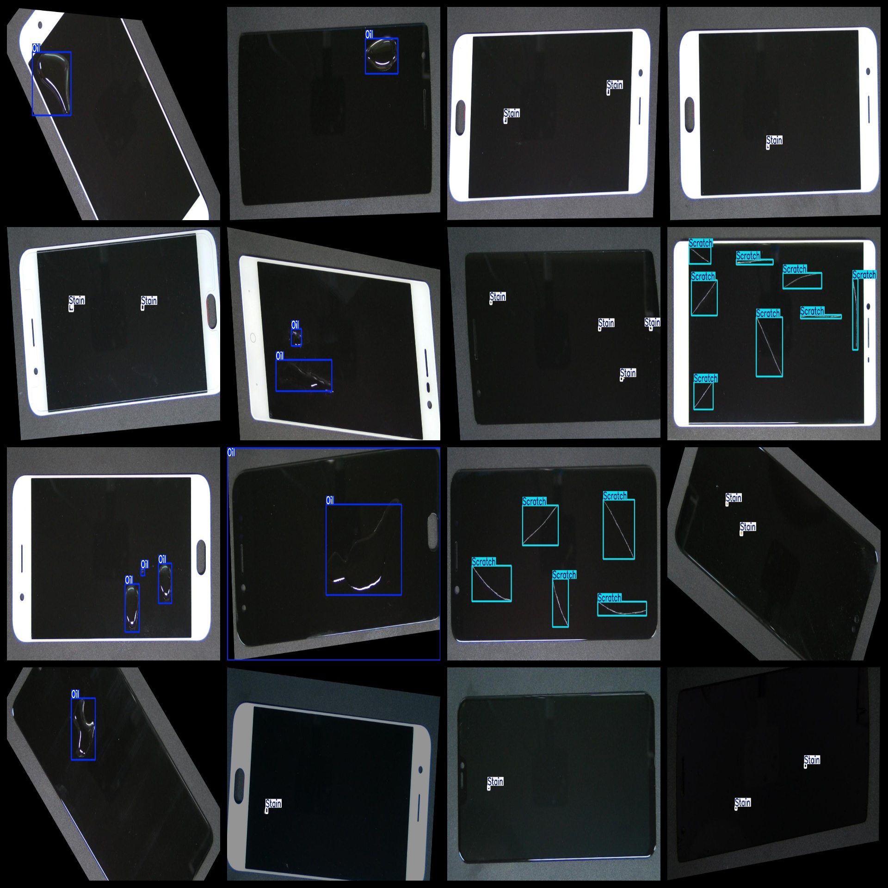
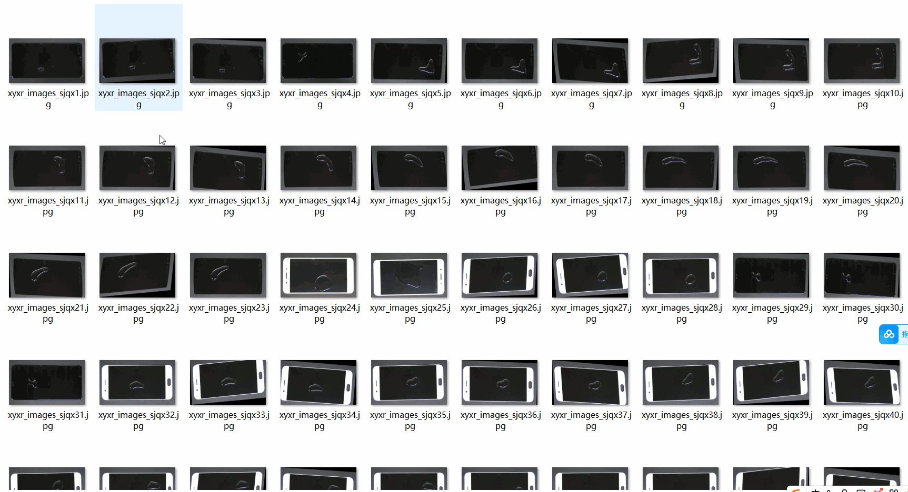

# [Object Detection] Intelligent Phone Screen Defect Dataset 4296 images in YOLO+VOC format

[Object Detection] Smartphone Screen Defect Dataset: 4296 images in YOLO+VOC format.

Dataset format: VOC format + YOLO format.

The zip file contains three folders, each storing images, xml, and txt files.

In the JPEGImages folder, there are a total of 4296 jpg images.

In the Annotations folder, there are a total of 4296 xml files.

In the labels folder, there are a total of 4296 txt files.

Number of labels: 3

Label names: ["Oil", "Scratch", "Stain"]

Label names: [“Oil”, “Scratch”, “Dust”]

Box numbers for each label (note that the order of category numbers in the YOLO format does not correspond to this, but is based on the classes.txt in the labels folder):

Oil box numbers = 1918

Scratch box numbers = 4439

Stain box numbers = 3910

Total box numbers = 10267

Image resolution (pixels): clear

Image enhancement: Yes

Shape of labels: rectangle boxes for target detection recognition.

Important note: No warranty given regarding the accuracy or weights of the trained models. The dataset only provides accurate and reasonable annotations.

Annotations and image details are as follows:
## Images

---

Here is a pay link on Stripe (https://buy.stripe.com/3cs8yP7sY87d0vu9AB). Please contact me lonlonago@foxmail.com after funding $89, and I will send you a complete data files, thank you!

